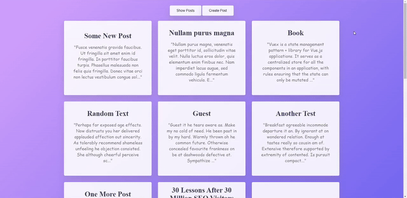

# PostsFromPostman

A simple blog with ability to create your own posts.

## Built With

* [React.js](https://en.reactjs.org/)
* [Next.js](https://nextjs.org/)
* [TypeScript](https://www.typescriptlang.org/)

## Prerequisites

Install [node.js](https://nodejs.org/en/) and [npm](https://www.npmjs.com/);

## Getting Started

#### Clone repository:

````
git clone https://github.com/IselDrew/PostsFromPostman.git
````

#### Install dependencies:

````
npm install
````

#### Build application:

````
npm run build 
````

#### Start application:

````
npm run start
````
Then go to localhost:3000


## Application preview


